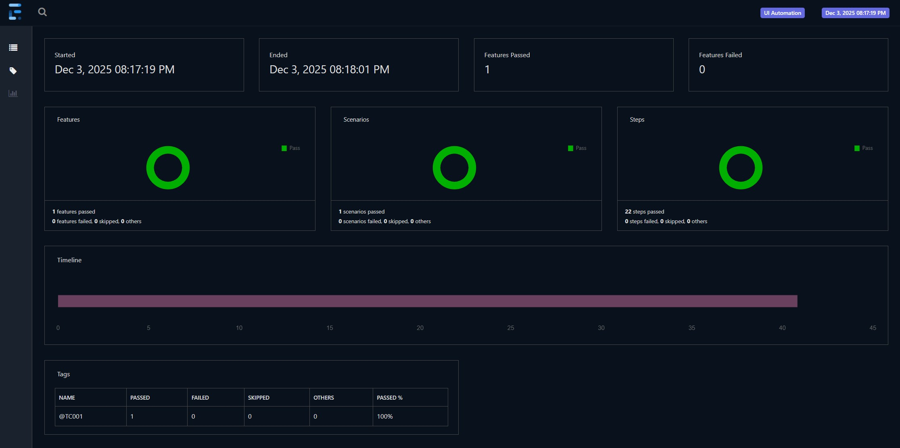

# 🚀 DittoAutomation

<p align="center">
  
  
  
  
</p>

---

DittoAutomation is a robust test automation suite built using **Java** and **Gherkin** (for BDD style definitions), aimed at validating the end-to-end **Policy Purchase Flow** of the Ditto platform. This project serves as a demonstration of automation best practices, modular code design, and maintainability

---

## 📒 Table of Contents

- [About The Project](#about-the-project)
- [Tech Stack & Tools](#tech-stack--tools)
- [Project Structure](#project-structure)
- [Getting Started](#getting-started)
- [Usage](#usage)
- [Demonstration](#demonstration)
- [Best Practices Followed](#best-practices-followed)
- [Contact](#contact)

---

## 📝 About The Project

**DittoAutomation** covers a full spectrum of scenarios within the **Policy Purchase Flow**. It leverages BDD principles for clarity and documentation, making tests both descriptive and understandable.

Key goals:
- 🟢 Ensure reliability of critical user journeys.
- 🟢 Provide a foundation for scalable automation with easy test case additions.
- 🟢 Showcase modular, maintainable code for both interviewers and team adoption.
- 🟢 Enable fast feedback via CI-ready tests.

---

## 🔧 Tech Stack & Tools

- **Language:** [Java](https://www.java.com/)
- **BDD:** [Cucumber / Gherkin](https://cucumber.io/docs/gherkin/)
- **Testing:** [TestNG](https://testng.org/)
- **Build Tool:** [Maven](https://maven.apache.org/)
- **Reporting:** Extent Reports
- **Additional Integrations:** Selenium WebDriver, Log4j2

---

## 🗂️ Project Structure

```plaintext
DittoAutomation/
├── src/
│   ├── main/
│   │   └── java/
│   └── test/
│       ├── java/
│       │   ├── managers/
│       │   │   └── DriverManager                # Singleton webdriver instance 
│       │   ├── runner/
│       │   │   └── TestRunner                   # Runner class
│       │   ├── stepdef/
│       │   │   ├── Hooks                        # setup and tear down steps
│       │   │   └── UIDefinition                 # method for script execution
|       |   |   
│       │   ├── ui.pages/                        # Page Object classes
│       │   │   ├── LandingPage                  
│       │   │   ├── MembersPage
│       │   │   ├── PlanPage
│       │   │   ├── PolicyPage
│       │   │   ├── PremiumPage
│       │   └── utils/                    
│       │       ├── ConfigReader                 # Loading properties file
│       │       ├── Log                          # log4j2 helper class
│       │       └── NumberFormatter              # Number formatting utility
│       └── resources/
│           ├── features/
│           │   └── HealthInsurance.feature
│           ├── config.properties
│           ├── extent.properties
│           ├── log4j2.xml
│           └── spark-config.xml
├── pom.xml     # Dependency management
├── README.md
└── ...
```

- **managers:** Singleton driver and resource managers.
- **runner:** Test runner configuration.
- **stepdef:** Step definitions and hooks for test execution.
- **ui.pages:** Page Objects for modular UI interaction.
- **utils:** Utility classes for config management, logging, and formatting.
- **features:** Gherkin scenarios for thorough test case documentation.
- **resources:** Config and reporting files supporting automation.

---

## 🚀 Getting Started

To get a local copy up and running:

### 1. Clone the Repository

```sh
git clone https://github.com/anandsreekanthask/DittoAutomation.git
cd DittoAutomation
```

### 2. Install Dependencies

```sh
mvn clean install    # For Maven
```

### 3. Run Test Suite

```sh
mvn test
# OR if a test runner class is used
mvn test -Dtest=YourTestRunner
```

---

## ⚙️ Usage

**Configuring Your Runs:**

- Update environment or credentials in `/src/test/resources/config.properties` (if required).
- Choose or create your feature files under `/resources/features/`.
- Run using IDE runner (Cucumber Test Runner) or command line.

**Reports:**
- Test reports will be generated in `/target/extent-report/`

---

## 🎬 Demonstration

<details>
  <summary>Click to see a sample test scenario</summary>
  
```gherkin
Feature: Health Insurance Validation

  Scenario Outline: Health Insurance Premium Validation
    Given I launch the application
    And I select "Optima Secure"
    And I proceed to click Next 3 times to navigate from Policy Info Page
    And I fill "<SelfGender>" and "<SpouseGender>"
    And I add 2 son(s) and 2 daughter(s) and proceed to Plan page
    And I enter "<SelfAge>", "<SpouseAge>" and "<ProposerPinCode>"
    And I enter children ages
      | type     | age |
      | daughter | 20  |
      | son      | 18  |
      | daughter | 10  |
      | son      | 12  |
    And I select "1 Cr" as the cover amount
    And I proceed to calculate the premium
    When I add the following riders
      | Unlimited Restoration | Optima Wellbeing | ABCD |
      | true                  | true             | true |
    Then I capture the total premium and validate the premium is calculated correctly for the riders
      | Unlimited Restoration | Optima Wellbeing | ABCD |
      | true                  | true             | true |

    Examples:

      | SelfGender | SpouseGender | SelfAge | SpouseAge | ProposerPinCode |
      | Male       | Female       | 45      | 40        | 560067          |
```
</details>




---

## 🏆 Best Practices Followed

- **Page Object Model (POM):** Promotes reusable, maintainable code.
- **Clear Gherkin Syntax:** Readable acceptance criteria for technical and non-technical stakeholders.
- **Modular Test Setup:** Easy to extend with new tests and steps.
- **Comprehensive Reporting:** Integrated Allure/Extent/other reporting.
- **CI Friendly:** Designed for quick integration into CI/CD pipelines (like GitHub Actions).

---

## 🤝 Contact

**Created & Maintained by [Anand Sreekanth](https://github.com/anandsreekanthask)**

- Email: anand.sreekanth30405@gmail.com
- LinkedIn: www.linkedin.com/in/anand-sreekanth

---

_This project is intended as a showcase example. For questions, collaborations, or feedback, feel free to reach out!_
